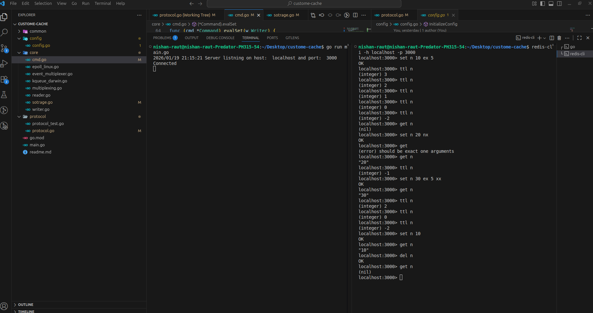

---

---
# Custom Cache (Redis-like)
A lightweight **Single Threaded Redis-inspired in-memory key-value store** written in Go.

It supports a subset of Redis commands using the **RESP (Redis Serialization Protocol)**, including TTL, conditional `SET` (`NX` / `XX`), and basic key operations.

> This project is built for learning and experimenting with how Redis works internally.

---
## Features

-  **In-memory key-value storage** with fast read/write operations

-  **TTL (Time To Live) support** for automatic key expiration

-  **RESP protocol compatibility** for Redis-like client communication

-  **Conditional SET operations** (`NX`, `XX` flags)

-  **Efficient syscall-based I/O** operations
---
## Supported Commands
### `PING`

Test server connectivity.  

```bash

PING [message]

```

**Examples:**

-  `PING` → Returns `PONG`

-  `PING "Hello"` → Returns `Hello`

---

### `SET`

Set a key to hold a string value with optional expiration and conditions.

```bash

SET  key  value [EX seconds] [NX|XX]

```
**Options:**

-  `EX seconds` - Set expiration time in seconds

-  `NX` - Only set if key does not exist

-  `XX` - Only set if key already exists

**Examples:**

```bash

SET  mykey  "Hello"  # OK

SET  mykey  "Hello"  EX  10  # OK (expires in 10 seconds)

SET  mykey  "Hello"  NX  # OK (only if key doesn't exist)

SET  mykey  "Hello"  XX  # OK (only if key exists)

```
---
### `GET`

Get the value of a key.

```bash

GET  key

```
**Returns:**

- The value stored at key

-  `nil` if key does not exist or has expired

**Example:**

```bash

GET  mykey  # "Hello"

```
---

### `DEL`

Delete a key.

```bash

DEL  key

```
**Returns:**

-  `OK` if key was deleted

-  `nil` if key does not exist

**Example:**

```bash

DEL  mykey  # OK

```
---
### `TTL`

Get the remaining time to live of a key in seconds.

```bash

TTL  key

```
**Returns:**

- Remaining seconds until expiration

-  `-1` if key exists but has no expiration

-  `-2` if key does not exist or has expired

-  `nil` if key does not exist

**Example:**

```bash

TTL  mykey  # 8

```
---
### `INFO`

Get server information.

```bash

INFO  # OK

```
---
### `COMMAND`
Get supported commands information.
```bash

COMMAND  # OK

```
---
## Protocol Support
This implementation uses the **RESP (REdis Serialization Protocol)**, making it compatible with Redis clients and tools.
---
## Limitations
- Single key operations for `DEL`, `GET`, and `TTL` (no multi-key support yet)

- No persistence (data is lost on restart)

- Limited to string values

---
## Contributing
Contributions are welcome! Please feel free to submit a Pull Request.
---
## Author
Nishan Raut

